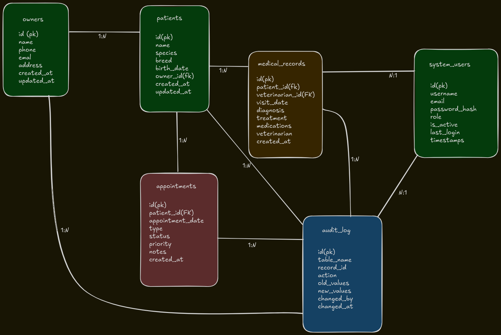

# VetFlow - Database Design Document

## 🎯 Objective

Management system for veterinary clinics allowing patient control, appointments and medical history tracking.

## 🗃️ Entity Relationship Diagram

## 📊 Core Tables Description

### owners

Stores pet owners information with contact details.

### patients  

Contains pets data and their relationship with owners. Includes medical basics like weight and allergies.

### medical_records

Tracks complete medical history for each patient visit.

### appointments

Manages scheduling system with priority and status tracking.

## 🔗 Relationships

- One owner can have MULTIPLE patients (1:N)
- One patient can have MULTIPLE medical records (1:N)  
- One patient can have MULTIPLE appointments (1:N)

## 🚀 Performance Considerations

- Indexes on foreign keys for fast joins
- Indexes on frequently searched fields (dates, emails)
